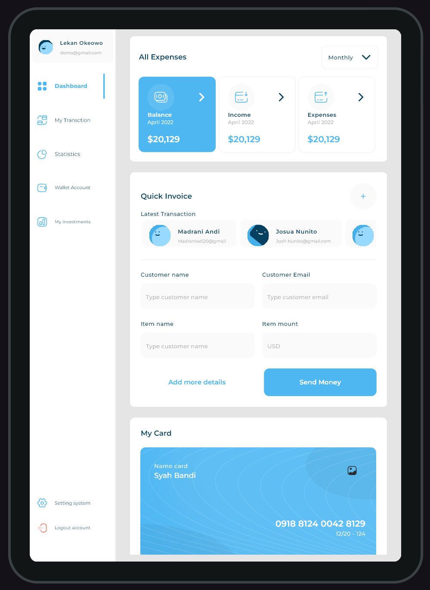

# Responsive Dashboard
This project showcases a fully responsive UI designed for various mobile devices.

## 📱 Demonstration Videos

Below are videos demonstrating the UI on different mobile devices:

<video width="100%" controls autoplay loop muted poster="demo/preview.png">
  <source src="demo/responsive.mp4" type="video/mp4">
  
  Your browser does not support the video tag.
</video>

## 🚀 Features
- Adaptive UI for various screen sizes
- Smooth transitions and animations
- Optimized performance for different resolutions

## 📧 Contact
For any issues or suggestions, feel free to reach out at
- 💼 [LinkedIn](https://www.linkedin.com/in/amira-nasser-sayed/)  
- 📧 Email: amira20nasser@gmail.com

